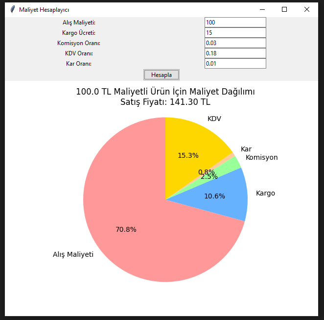

# MaliyetHesaplayici

Bu proje, ürünlerin maliyetini hesaplamak için kullanılan bir Tkinter tabanlı GUI uygulamasıdır. Kullanıcılar, ürünün alış maliyeti, kargo ücreti, komisyon oranı, KDV oranı ve kar oranını girerek, ürünün KDV dahil satış fiyatını ve maliyet dağılımını görselleştiren bir grafik elde edebilirler.

## Özellikler

- **Girdi Alanları**: Kullanıcılar alış maliyeti, kargo ücreti, komisyon oranı, KDV oranı ve kar oranını girebilirler.
- **Hesaplama**: Uygulama, girilen verileri kullanarak ürünün KDV dahil satış fiyatını hesaplar.
- **Grafik**: Maliyet dağılımını ve satış fiyatını görselleştiren bir pasta grafik oluşturur.

## Kullanım

1. **Gerekli Kütüphaneler**: 
    - `matplotlib`
    - `tkinter`

    Bu kütüphaneler genellikle Python’un standart dağıtımında bulunmaktadır. Ancak eksikse, aşağıdaki komutla yükleyebilirsiniz:
    [pip install matplotlib]

Uygulamayı Çalıştırma:

Python 3.x yüklü olduğundan emin olun.
Proje dosyasını indirin veya kopyalayın.
Terminal veya komut istemcisinde, dosya yoluna gidin ve aşağıdaki komutu çalıştırın:

** python MaliyetHesaplayici.py **

  

# Bu uygulama, e-ticaret vesaire gibi platformlarında ürün maliyetlerini ve satış fiyatlarını hesaplamak, maliyet analizi yapmak ve fiyatlandırma stratejilerini görselleştirmek için tasarlanmıştır.
